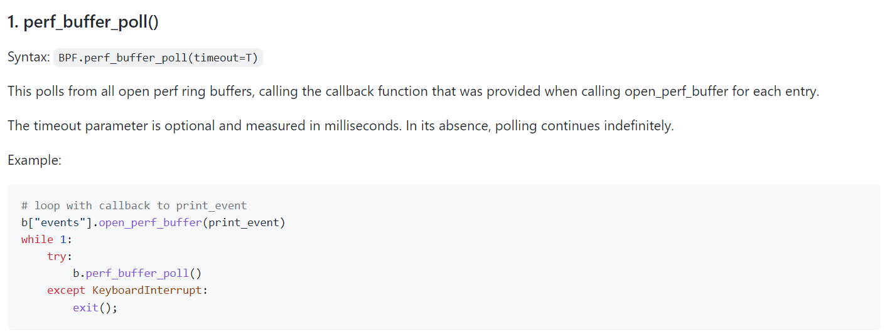
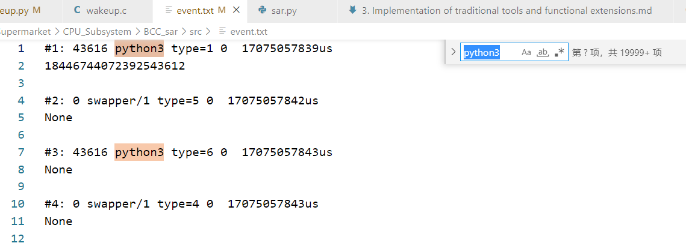

### 一个非常值得记录的BPF_PERF_OUTPUT和perf_buffer_poll陷阱

### 1. 陷阱的发现与调试

之前在使用bpf_perf_output来实现将BPF在**内核态**获取到的信息传送到**用户态**的时候，发现在运行时，CPU占用率竟然高达90%以上，这使我非常震惊。按照我的理解，我在BPF中设置的挂载点只有sched:sched_switch和sched:sched_wakeup，一般这两个事件加和起来的**每秒发生的数目**不超过1000，大概在800~900这个区间内。按理说，这个数据量的传送是不足以使系统有那么高的占用率的。于是我开始排查原因。

#### 1.1 之前的代码

```python
bpf["events"].open_perf_buffer(print_event, page_cnt=128)

while 1:
    bpf.perf_buffer_poll()
```

#### 1.2 从perf_buffer_poll开始调试

perf_buffer_poll这个函数官方的解释是这样的：



主要的功能就是从打开的perf buffer(perf缓冲区)poll数据，对于在perf buffer里面获取到的每一条数据，都用这些数据作为参数去调用之前用**open_perf_buffer**注册的回调函数。如果没有设定timeout的值，那么就一直进行poll的过程。

是的，解释就是这些了，而且这是**用户态**从perf buffer**读取数据的唯一函数**了。在BCC官方的例子中，注册好回调函数之后，我们需要循环调用perf_buffer_poll来等待perf buffer缓冲区里数据的进入。就像这样：

```python
while 1:
	bpf.perf_buffer_poll()
```

启动倒是容易，**难的是关闭**。一般来说，我们运行这类BCC程序一般使用Ctrl+C的方式关闭程序。官方的示例函数中将perf_buffer_poll函数用 try ... catch包裹了起来，目的是想要其在收到KeyBoardInterrupt时，就catch到它并将程序退出。和我们程序的唯一区别是我们的程序会抛出一个异常，而上面的程序可以直接终止。

但是在实操的时候，我们按Ctrl+C，程序不会停止，而且会打印很多报错信息（只有按键时才打印），只有我们按住Ctrl+C，这时程序先是会在我们按键的同时打印一堆错误信息，最后停下。打印的错误信息如下：

（原始输出无回车，为了方便观看加的回车）

```txt
^CException ignored on calling ctypes callback function: <function PerfEventArray._open_perf_buffer.<locals>.raw_cb_ at 0x7f1053eecd30>
Traceback (most recent call last):
  File "/usr/lib/python3/dist-packages/bcc/table.py", line 767, in raw_cb_
    callback(cpu, data, size)
  File "/home/zrp/LMP/eBPF_Supermarket/CPU_Subsystem/BCC_sar/src/wakeup.py", line 117, in print_event
    pidEvent[pid].append(pid_str)
KeyboardInterrupt: 

Exception ignored on calling ctypes callback function: <function PerfEventArray._open_perf_buffer.<locals>.raw_cb_ at 0x7f1053eece50>
Traceback (most recent call last):
  File "/usr/lib/python3/dist-packages/bcc/table.py", line 767, in raw_cb_
    callback(cpu, data, size)
  File "/home/zrp/LMP/eBPF_Supermarket/CPU_Subsystem/BCC_sar/src/wakeup.py", line 103, in print_event
    for addr in bpf["stacktraces"].walk(stackid):
  File "/usr/lib/python3/dist-packages/bcc/table.py", line 974, in walk
    return StackTrace.StackWalker(self[self.Key(stack_id)], self.flags, resolve)
  File "/usr/lib/python3/dist-packages/bcc/table.py", line 357, in __getitem__
    raise KeyError
KeyError: 

^CException ignored on calling ctypes callback function: <function PerfEventArray._open_perf_buffer.<locals>.raw_cb_ at 0x7f1053eece50>
Traceback (most recent call last):
  File "/usr/lib/python3/dist-packages/bcc/table.py", line 766, in raw_cb_
    try:
KeyboardInterrupt: 

^CException ignored on calling ctypes callback function: <function PerfEventArray._open_perf_buffer.<locals>.raw_cb_ at 0x7f1053eece50>
Traceback (most recent call last):
  File "/usr/lib/python3/dist-packages/bcc/table.py", line 767, in raw_cb_
    callback(cpu, data, size)
  File "/home/zrp/LMP/eBPF_Supermarket/CPU_Subsystem/BCC_sar/src/wakeup.py", line 103, in print_event
    for addr in bpf["stacktraces"].walk(stackid):
  File "/usr/lib/python3/dist-packages/bcc/table.py", line 974, in walk
    return StackTrace.StackWalker(self[self.Key(stack_id)], self.flags, resolve)
  File "/usr/lib/python3/dist-packages/bcc/table.py", line 355, in __getitem__
    res = lib.bpf_lookup_elem(self.map_fd, ct.byref(key), ct.byref(leaf))
KeyboardInterrupt: 
```

大致就是，先输出一行：

```txt
Exception ignored on calling ctypes callback function: <function PerfEventArray._open_perf_buffer.<locals>.raw_cb_ at 0x7f1053eece50>
```

然后报告一个异常信息：

```
Traceback (most recent call last):
  File "/usr/lib/python3/dist-packages/bcc/table.py", line 767, in raw_cb_
    callback(cpu, data, size)
  File "/home/zrp/LMP/eBPF_Supermarket/CPU_Subsystem/BCC_sar/src/wakeup.py", line 103, in print_event
    for addr in bpf["stacktraces"].walk(stackid):
  File "/usr/lib/python3/dist-packages/bcc/table.py", line 974, in walk
    return StackTrace.StackWalker(self[self.Key(stack_id)], self.flags, resolve)
  File "/usr/lib/python3/dist-packages/bcc/table.py", line 355, in __getitem__
    res = lib.bpf_lookup_elem(self.map_fd, ct.byref(key), ct.byref(leaf))
KeyboardInterrupt: 
```

错误信息有两类，**KeyError** 和 **KeyboardInterrupt**。

我们先不关注KeyError，先看 **KeyboardInterrupt**。我们知道这是由于我们**按下Ctrl+C由Python捕获**所以产生的异常，但是为什么Python出现了异常不立刻中断程序呢？再看上面一行我们发现，这是由于发生异常的时间是在我们调用Ctypes库定义的C函数 (PerfEventArray._open_perf_buffer) 的时刻。这一时刻，Python默认捕获错误信息，但是**不中断进程的执行**。

这个错误非常诡异，我查了半天也不知道为什么。所以先放下，我们来分析一下程序的异常行为。

### 1.3 程序的结构及其异常行为

在bpf程序中，我设定了几个需要记录的**自定义事件**，这些事件由原来的tracepoint挂载点**衍生而来**：

* SLEEP_BEGIN
* SLEEP_END
* RUN_BEGIN
* RUN_END
* WAIT_BEGIN
* WAIT_END

其中每一个事件都是在对应的tracepoint中判断当前状态从而按照需求调用的，使用到的tracepoint只有sched:sched_switch和sched:sched_wakeup两个。而在每个事件中，我都调用perf_submit将事件的数据传送到perf buffer。代码如下所示：

```c
__always_inline static void begin_sleep(struct pt_regs *ctx) {
    struct task_struct *ts = bpf_get_current_task();
    u32 pid = ts->pid;
    struct perf_data data = {};

    data.stackid = stacktraces.get_stackid(ctx, 0);
    data.pid = pid;
    data.type = BEGIN_SLEEP;
    data.waker = 0;
    data.time = bpf_ktime_get_ns();

    // 获取进程的comm
    bpf_get_current_comm(&data.comm, sizeof(data.comm));

    // 向用户空间传送睡眠进程名、pid以及发生阻塞时的栈信息
    events.perf_submit(ctx, &data, sizeof(data));
    // inc_count();
    // bpf_trace_printk("#%-8d Begin Sleep", pid);
}
```


使用Map记录这两个tracepoint发生的次数，然后在用户态记录print_event(回调函数的执行次数)，用户态程序如下：

```python
# perf数据接收回调函数
def print_event(cpu, data, size):
    global cnt
    cnt += 1 # 保存回调函数执行次数，也就是接收到信息的条数
    # 成员：pid, comm, type, stackid, waker, waker_comm, time
    event = bpf["events"].event(data)

    ...    
```

并加如下程序，确保程序能在我们给定的时间内停止并打印执行次数：

```python
start = time()
while 1:
    bpf.perf_buffer_poll()
    if time() - start > args.time:
    	break

print(cnt)
print("count = ", bpf["countMap"][0].value)
```

运行3s，结果发现输出为：

```txt
420429
count =  109443
```

tracepoint执行了109443次，与事件数相当，说明**高频输出的原因就是来源于tracepoint**。两个tracepoint的每秒执行次数为30000多，不符合常理。

#### 1.4 解决问题

这时我反思，究竟是哪个环节出了问题，才会使得tracepoint执行次数如此偏高？后我想到tracepoint挂载的点是sched_switch和sched_wakeup，那么是不是因为python程序的运行所导致的呢？我查看了一下输出日志，含有python3的项竟然高达19999+(下图)，说明这种情况是可能的。



那么为什么我们写的BCC Python程序的执行会**如此剧烈地**tracepoint的值呢？经过反复思考，我得出了一个猜想: python程序在调用poll函数的时候同时会引发一些事件，导致eBPF程序执行，将事件写入到perf buffer。之后，事件的写入又导致正在等待poll的Python程序被唤醒，接着又执行poll，然后引发eBPF程序的执行，再次唤醒Python程序，...，如此往复，这样Python程序就会一刻不停地执行，CPU占用率接近100%可以佐证这个猜想。下面我们画图来总结完整的思路：


其实细想一下，导致这种现象的主要原因就是perf_buffer_poll函数连续执行，**中间没有空隙**。上一个perf_buffer_poll将perf缓冲区内的数据全部读取完毕之后；**下一个poll接着执行**，目前缓冲区为空，所以进入等待状态，让出CPU，这时触发sched_switch，eBPF向perf buffer中写入数据之后就将Python程序唤醒，完成poll函数，以此类推。

可以发现，破坏这个死循环的方法就是将两个poll之间留一点间隙，使得之后Python程序不会立刻被eBPF写入数据的行为唤醒。我设定的间隔为sleep(1)，也就是睡眠1s。这样，Python会先睡眠，之后每隔1s读取缓冲区中的内容并调用print_event函数，之后又睡眠，然后又调用，......。这样可以把节奏控制在1Hz左右，并且**不会产生连环运行-唤醒**的情况。

代码如下：

```python
while 1:
    bpf.perf_buffer_poll()
    sleep(1)
    if time() - start > args.time:
	    break
```

运行程序3s，可以发现tracepoint发生的频率降低到了正常的水平（约1000Hz）。查看事件输出，可以发现含有Python3的事件只有20件，说明Python程序的运行已经被成功的控制了下来。进一步查看，发现Python的睡眠次数为3，说明Python3只在运行sleep的时候休眠，而不会在poll的时候休眠，即**poll每一次都能取到数据**，不需要等待。

在每一次Python进入运行状态时，可能由于数据量较大，python需要运行**较长时间**才能得到结果。这时，Python会先运行一个时间片，然后等待，之后运行、等待，反复多个时间片才将任务执行完毕。下面是我得到的一个典型的事件序列：

```
#22199: 44076 python3 BEGIN_RUN 0  19922610168us
#22201: 44076 python3 END_WAIT 0  19922610168us
#22206: 44076 python3 BEGIN_WAIT 0  19922612705us
#22208: 44076 python3 END_RUN 0  19922612706us

#22211: 44076 python3 BEGIN_RUN 0  19922612760us
#22213: 44076 python3 END_WAIT 0  19922612760us
#22216: 44076 python3 BEGIN_WAIT 0  19922612771us
#22218: 44076 python3 END_RUN 0  19922612773us

#22221: 44076 python3 BEGIN_RUN 0  19922612779us
#22223: 44076 python3 END_WAIT 0  19922612779us
#22226: 44076 python3 BEGIN_WAIT 0  19922612796us
#22228: 44076 python3 END_RUN 0  19922612798us
```

其他说明：

* 由于我们是每秒读取perf buffer，因此要确保perf_buffer**能容纳一秒产生的数据量**，否则就会产生Lost Events (Lost Events的机制见http://blog.itaysk.com/2020/04/20/ebpf-lost-events)
* print_event回调函数应当**执行得足够快**，不然也会导致KeyError或者Lost Events的问题（但是允许在print_event里面写入文件，print输出的话一般不推荐）
* 同样地，BPF_STACKTRACE这个map也要保证足够存储1s内产生的stack存储数据量，不然就会出现KeyError（原因自己思考）

#### 1.5 最终结果

程序没有关联唤醒问题的情况下，静态时，wakeup程序中每秒钟触发的Tracepoint数目应该在1000以下，记录的事件数大概是Tracepoint数目的3倍，大概在3000个/s。下图是3s时间内记录的tracepoint数和事件数：


### 2. 知识点梳理

* bpf.perf_buffer_poll()函数的作用是读取perf缓冲区。当缓冲区有一定数据时（比如1024个数据），那么poll就会持续读取缓冲区内的数据，交给回调函数处理，处理完之后返回；当缓冲区内不存在数据时，poll会等待，如无timeout，可以等待无限长的时间**直至event出现**，这时处理数据并返回；若有timeout，则**最多等**timeout时间，如果在timeout时间内等到了，就立刻执行，然后返回，**不必等满timeout**。

* open_perf_buffer()函数可以设置perf缓冲区的**内存页数**，和发生LOST Events时的回调函数。